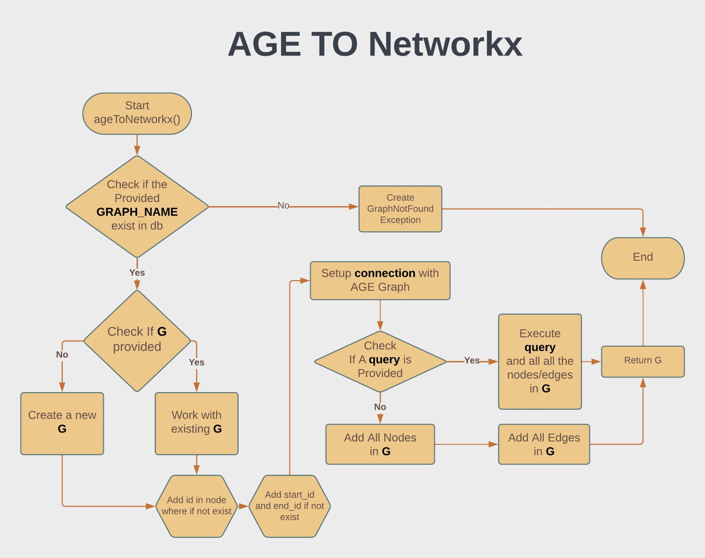
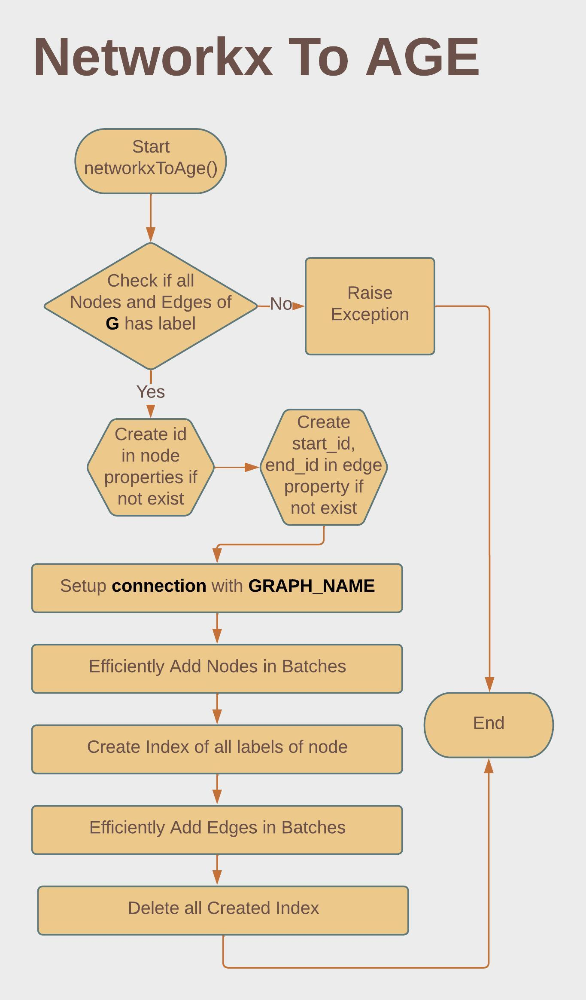

# Support for python Networkx

## AGE TO Networkx
`ageToNetworkx()` Function Creates a Directed Graph from AGE Graph db. It will load all the nodes and edges it can find from the age db to networkx

### How to use
```py
import psycopg2
from age.Networkx import *
# set DB path and graph name
conn = psycopg2.connect(
    host="localhost",
    port="5430",
    dbname="postgresDB",
    user="postgresUser",
    password="postgresPW")
graphName = 'bitnine_global_inic'

G = ageToNetworkx(conn,graphName)
```

### Parameters
- connection - psycopg2.connect
    - A connection object when retruning from psycopg2.connect

- graphName - string
    - Name of the Graph

- G - Networkx directed Graph
    - Previous Networkx Graph

- query - string
    - A cypher query

- isPrint - bool
    - Printing the progress after certain steps

### Returns
- nx.DiGraph
    - A Networkx Directed Graph

### Workflow



## Networkx to AGE
 This Function add the nodes and edges found from a Networkx Directed Graph to Apache AGE Graph Database

### How to use
```py
import psycopg2
from age.Networkx import *
# set DB path and graph name
conn = psycopg2.connect(
    host="localhost",
    port="5430",
    dbname="postgresDB",
    user="postgresUser",
    password="postgresPW")
graphName = 'bitnine_global_inic'

# Create an empty graph
G = nx.DiGraph()

G.add_node('user1',label='User',properties={'name':'Moontasir'})
G.add_node('movie1',label='Movie',properties={'name':'The Shawshank Redemption'})
G.add_edge('user1','movie1', label='Watched')

networkxToAge(conn, G, graphName=graphName)
```


### Parameters

- connection - psycopg2.connect
    - A connection object when retruning from psycopg2.connect

- G - nx.DiGraph
    - A Networkx Directed Graph

- graphName - string
    - Name of the Graph

- nodeBatchCount - int
    - max number of nodes in a batch to be created

- edgeBatchCount - int
    - max number of edges in a batch to be created

- isPrint - bool
    - Printing the progress after certain steps

### Returns
- None

### Workflow

